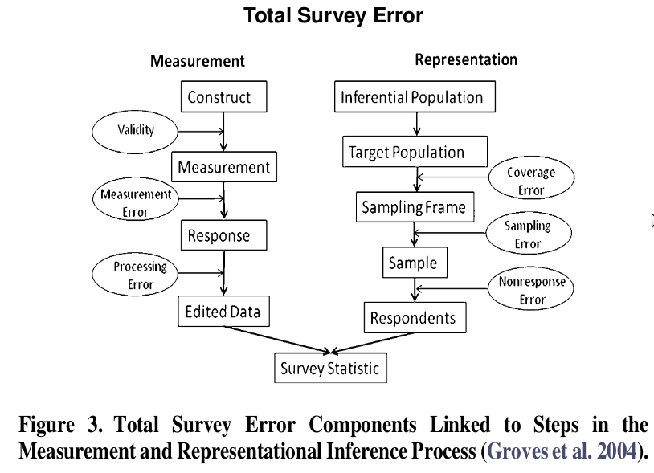

  ```{r options_communes, include=FALSE}
source("options_communes.R")
```


<div class="important">

  Data Cleaning is an essential step in data analysis. Most of the cleaning should allow to predect some potential errors in the dataset.


</div>


A multiplicity of errors can occurs during a survey. Once data are collected only a few of them can be addressed.





## Cleaning linked to the sample

In this case, some household were visited multiples times. The only way to address this is to have a cleaning log that contains the uniqueID (meta_instance_id) of the questionnaires that will need to be deleted.

## Cleaning on numeric variable: Filter Unwanted Outliers

Outliers on numeric variable can be spotted looking at the value of standard deviation.

Keep in mind that "outliers are innocent until proven guilty". Sometimes they traduce a proable in data collection but sometimes it can also add important information. One must have a good reason for removing an outlier, such as suspicious measurements that are unlikely to be real data.

## Cleaning categoric variables: review categories

xlsform allow to add the option of using __or_other__ when raising a categoric questions. Often the results of this sub-variable needs to be reviewed to ensure that the or_other can not be affected to any existing value.

The other point to check is low-frequency modalities that might need to be compacted together. This is also important in the sense that it will facilitate the data anonymisation in case this variable is a key one.

## Fix labeling

When recoding the data set it can appears often that the label attributed to the variables when raising the questions are not worded well, comme with typos / capitalisation issues or are too long to appear in a report. This can be fixed directly within the xlsform used for the data analysis plan.

## Handle Missing Data

This can be important when developing the analysis for the scoring. 

The 2 most commonly recommended ways of dealing with missing data  are:

 * Dropping observations that have missing values: Dropping missing values is sub-optimal because when you drop observations, you drop information. The fact that the value was missing may be informative in itself.
 
 * Imputing the missing values based on other observations
 
 
The best way to handle missing data for categorical features is to simply label them as ’Missing’!

 * You’re essentially adding a new class for the feature.
 * This tells the algorithm that the value was missing.
 * This also gets around the technical requirement for no missing values.

For missing numeric data, you should flag and fill the values.

 * Flag the observation with an indicator variable of missingness.
 * Then, fill the original missing value with 0 just to meet the technical requirement of no missing values.

By using this technique of flagging and filling, you are essentially allowing the algorithm to estimate the optimal constant for missingness, instead of just filling it in with the mean.


