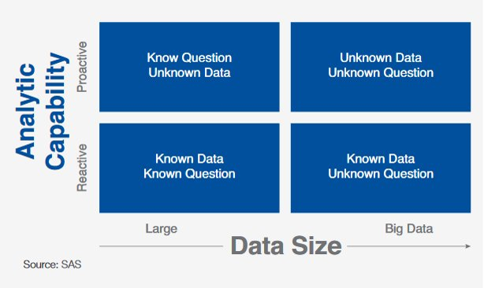

```{r options_communes, include=FALSE}
source("options_communes.R")
```

<div class="note">
 **Key Take Away** :
</div>


## Challenges with Household Survey analysis

Household survey often results in dataset with over 300 variables to process & explore. Deadline to get insight from the dataset are often tight and Manual processing is very lengthy and can be done only for a limited part of the dataset. Often, because of those challenges, a lot of potential insights are not discovered.

To address this, it's necessary to move from a reactive support to a proactive one. 



Data Crunching is about automating processes:

 *  Upstream process of data interpretation: consists of the __preparation of a dataset__ so that it can be processed, sorted and structured to run algorithms and program sequences on it;  
 
 *  Can __save a lot of time__ as the processes do not need to be performed manually (different from data munging and data wrangling that refers manual processing of data);

 *   Can be __iterative__ when the output of the crunching process includes new data or reveals errors. This means that the program sequences may be repeated until the desired result is achieved;  

 *  Enable better [__analysis reproducibility__](http://edouard-legoupil.github.io/humanitaRian-data-science/slides/) (minimize point & click interventions) to facilitate peer review


## Data Crunching Automation

Using the right combination of packages from the R statistical language, it is possible to  integrate all necessary data analysis steps into **scripts**:

 * Data management (clean, recode, merge, reshape)

 * Data analysis (test, regression, multivariate analysis, etc...)
 
 * Data visualisation (plot, map, graph...)

 * Writing up results (report and presentation generation)


## Using KoboloadeR to facilitate reproducibily.

Before data visualization & interpretation many steps are required:

### Import raw data   

In a structured survey with numbered questions, the __flat file__ type of data structure has a column for each question, and a row for each respondent. A more complex survey data structure arises if the data are  __hierarchical__. A common type of hierarchy is where a series of questions is repeated say for each child in the household, and combined with a household questionnaire, and maybe data collected at community level. For analysis, we can create a rectangular flat file, at the ‘child level’, by repeating relevant household information in separate rows for each child. Similarly, we can summarise information for the children in a household, to create a ‘household level’
analysis file.

In the case of hierearchical dataset, it is required to use [ODK Briefcase](https://opendatakit.org/downloads/download-category/briefcase/) to export and configure the key to  join the frame together.

 
### Recode & Relabel

 * Leverage the same [xlsform](http://xlsform.org) file (saved as .xls – not .xlsx) already used to encode the questionnaire to generate a data dictionary
 * Extend xlsform by adding additional column (chapter, disaggregation, correlation, etc.)
 * Potentially revise label wording to make them more concise when they will appear on the output chart

 
### Clean records 
 
 * Cleaning Log defined though the iteration of the crunching 
 * Log stored as a worksheet, act as documented data audit trail
 * Log actions to be sorted as “update” or “delete”
 * Log to be re-applied every time to raw date 

 
### Reweight dataset according to sampling strategy, 
 
 * Associate a weight to each record
 * Weight defined by the sampling script (can be based on cluster, or Respondent Driven Sample)
 * Possibility to use post-stratification to re-compute corrected weights in case of low coverage of the sample

 
### Build new indicators from existing variable, etc.  

Indicators are summary measures. They often provide a baseline from which to weigh up the finer points. It is important not to create unnecessary confusion. An indicator should synthesise information and serve to represent a reasonable measure of some issue or concept. The concept should have an agreed name so that users can discuss it meaningfully.

 * Create new indicators from existing one: Need to define in a worksheet for each indicator: type, name, label, chapter, correlation, aggregation, formula, frame
 
 * Indicators formula written with a R-ready syntax: Allow for complex notation:  
 
    *   May need to use dcast if you want to calculate an indicator based on values from a nested data frame.  dcast will work as pivot table using the unique ID used for the join.
    *   May need to use if when trying to do a calculation where you could have  potential zero as numerator
    Indicators are calculated, appended to the right data frame and then the indicator definition is appended in the data dictionary


## KoboloadeR 

It is An R packages (i.e. a series of functions) that can be plugged to a configuration file in order to separate “input”, “processing”, and “output”

 * The “output” is an Rmd (Rmarkdown) file than produce word, pdf or html reports  


 * The configuration file includes references to all “input”:  
 
        Path to raw data files
        Path to form (in xlsform) in order to build a data dictionary
        Path to the sample weight 
        Path to the data cleaning log
        Path to the indicator calculation sheet 


### Collaborative Development

 *  Open Source Package maintained in [GitHub](https://github.com/Edouard-Legoupil/koboloadeR)  
 
 *  Submit issues for [bug report or feature request](https://github.com/Edouard-Legoupil/koboloadeR/issues) in Github 
 
 *  [Fork and submit pull request](https://github.com/Edouard-Legoupil/koboloadeR/tree/master/R#fork-destination-box) for code review and integration

