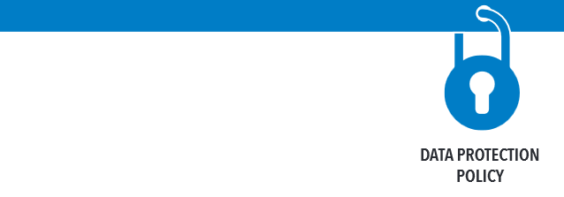

```{r options_communes, include=FALSE}
source("options_communes.R")
```

<div class="important">
This chapter is not written yet.
</div>


##  UNHCR Data Protection Policy

The [Policy on the Protection of Personal Data of Persons of Concern to UNHCR](http://www.refworld.org/docid/55643c1d4.html) has been issued in May 2015. 



In addition of the clarification of the basic principles to be applied when collecting information that includes **Personally Identifiable Information (PII)**, the policy recall the  needs to carry out **Data Protection Impact Assessment (DPIA)**. A DPIA is required where the collection and processing or transfer of personal data is likely to be large, repeated or structural. 

Bceause most of "Protection Assessment" fall under that policy as they are linked with the need to be able to process referals, personally identifiable information are often required. In addition, information such a precise coordinates of individuals with specific profile or needs might also fall unde the policy.

## The 12 privacy principles

Data Protection Impact Assessments (PIAs) are an integral part of taking the "[privacy by design](https://ico.org.uk/for-organisations/guide-to-data-protection/privacy-by-design/)" approach. This is done by enforcing the following 12 principles:

1. **Consent and choice**: presenting to the data subject the choice whether to allow the processing of their personally identifiable information (PII)

2. **Purpose legitimacy and specification**: ensuring that the purpose of data collection is specified and lawful

3. **Collection limitation**: limiting the collection of PII to that which is within applicable law and strictly necessary for the specified purpose(s)

4. **Data minimisation**: minimising the PII processed and the number of privacy stakeholders to whom PII is disclosed or who have access to it

5. **Retention and deletion**: ensuring that data is not kept for longer than is necessary for the purpose specified

6. **Accuracy and quality**: ensuring that the PII processed is accurate, complete, up to date (unless there is a legitimate basis for keeping outdated data), adequate and relevant for the purpose of use

7. **Openness, transparency and notice**: providing data subjects with clear and easily accessible information about the PII controller’s policies, procedures and practices with respect to processing of PII

8. **Individual participation and access**: giving data subjects the ability to access and review their PII, provided their identity is first authenticated (Access and correction)

9. **Accountability**: assigning to a specified individual within the organisation the task of implementing the privacy-related policies, procedures and practices

10. **Information security**: protecting PII under an organisation’s control with appropriate controls at the operational, functional and strategic level to ensure the integrity, confidentiality and availability of the PII, and to protect it against risks such as unauthorised access, destruction, use, modification, disclosure or loss.

11. **Privacy compliance**: verifying and demonstrating that the processing of data meets data protection and privacy legislation by periodically conducting audits using internal or trusted third-parties

12. **Data transfers**: do not store or transfer personal data to third parties without adequate assurances that they will safeguard it to a standard comparable to that of the UNHCR.

## Threat & vulnerability matrix

The [template from the UK ICO](https://ico.org.uk/media/for-organisations/documents/1042836/pia-code-of-practice-editable-annexes.docx) can be used a starting point to developd the document. 

An important point is to build the threat & vulnerability matrix:

Potential Threats to look at | Vulnerability  | Risk         | Mitigation
---------------------------- | -------------  | ------------ | ------------- 
Cyber espionage              |                |              |                
Physical loss of data        |                |              |                
Technical failure            |                |              |               
Unauthorised acquisition     |                |              |               
DDOS attack / malware        |                |              |               
Insider privilege abuse      |                |              |               
Partner abuse                |                |              |               
Partner negligence           |                |              |               
Refugee complaints litigation|                |              |               
Reputational damage          |                |              |               


## Deleting dataset

Personal data that is not recorded in individual case files is not to be retained longer than necessary for the purpose(s) for which it was collected.

Though this should not minimise the need to save anonymised copies of the dataset in order to ensure potential new analysis of the data or longtidinal analysis. See [the last chapter for more information on this](Microdata.html).

## Technical measures necessary to comply with the policy

*  Maintaining physical security of premises, portable equipment, individual case files and records;

*  Maintaining computer and information technology (IT) security, for example, access control (e.g. passwords, tiered access), user control, storage control, input control, communication and transport control (e.g., encryption).

## Standard Operating Procedures necessary to comply with the policy


A DPIA would contain a general description of:

* the envisaged project, 
* data sharing agreement in place
* arrangement involving processing of personal data (for instance clarififcation on protection referal), 
* analysis of the risks to the rights of data subjects by virtue of the circumstances 
* nature of the personal data processed, 
* safeguards and security measures in place or proposed.

