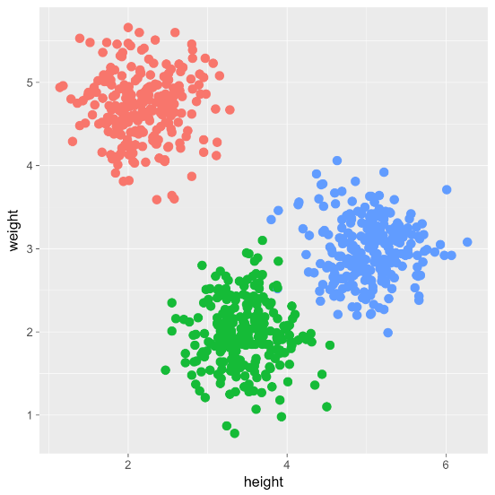

```{r options_communes, include=FALSE}
source("options_communes.R")
```


<div class="important">
This chapter is not written yet.
</div>

Cluster analysis is a data-driven statistical technique that can draw out – and thence characterise – groups of respondents whose response profiles are similar to one another. The response profiles may serve to differentiate one group from another if they are somewhat distinct. This might be needed if the aim were, say, to define target groups for distinct safety net interventions. The analysis could help clarify the distinguishing features of the groups, their sizes, their distinctness or otherwise, and so on. Unfortunately there is no guarantee that groupings derived from data alone will make good sense in terms of profiling respondents. 

Cluster analysis does not characterise the groupings; you have to study each cluster to see what they have in common. Nor does it prove that they constitute suitable target groups for meaningful development interventions Cluster analysis is thus an exploratory technique, which may help to screen a large mass of data, and prompt more thoughtful analysis by raising questions such as:  

 *  Is there any sign that the respondents do fall into clear-cut sub-groups?  
 
 *  How many groups do there seem to be, and how important are their separations? 
 
 *  If there are distinct groups, what sorts of responses do “typical” group members give?  
 




## Multivariate Analysis

Refugees profile are defined by multiple categories. However it is very difficult for the human brain to process more than 7 categories toggether. An important challenge to understand the profile of the population is to discover how categories interact together. Fortunately, since the 70's, Social scientist have developed technique that allow to discover statistical clusters among a specific population. 

Multiple Correspondence Analysis ([MCA](https://en.wikipedia.org/wiki/Multiple_correspondence_analysis)) is a data analysis technique for nominal categorical data, used to detect and represent underlying structures in a data set.


### Dimensionnality reduction

The first step of the analysis is to reduce the numbers of dimansion in order to represent each observation in a 2D space.

### Clustering

Clustering is the task of grouping a set of objects in such a way that objects in the same group (called a cluster) are more similar (in some sense or another) to each other than to those in other groups (clusters). Refugee data are mostly categorical so clustering is done on the result of the Multiple Correspondence Analysis.


### Hierarchical Classification on Principle Components

### Description of statistical clusters


